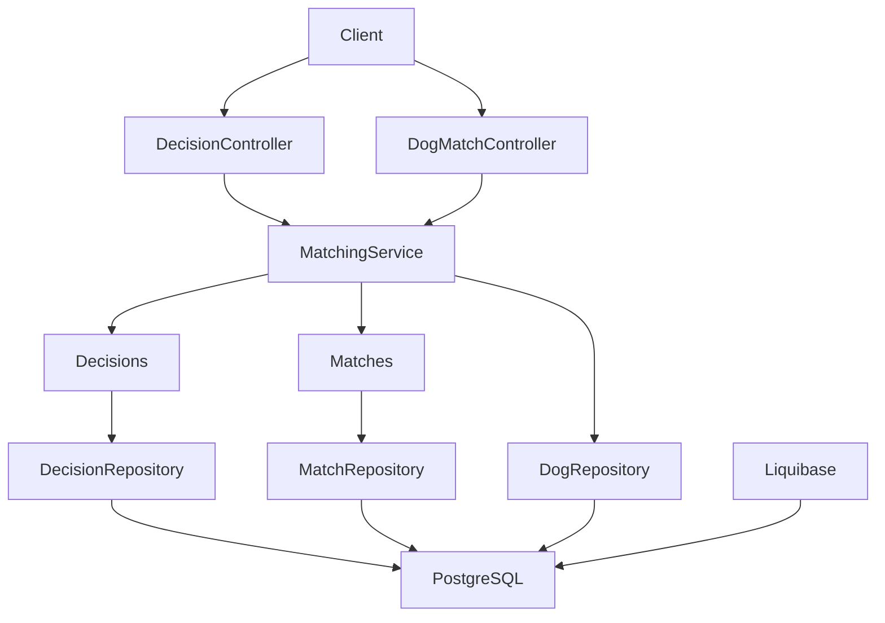
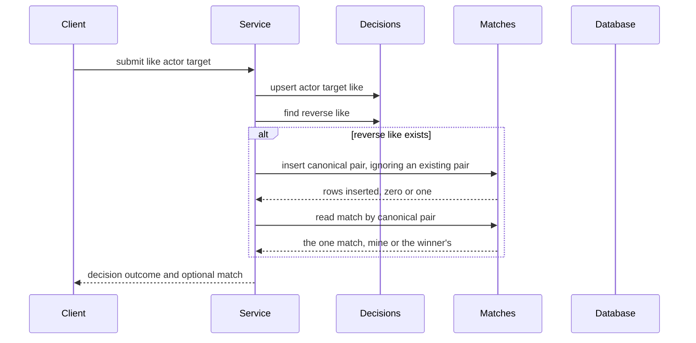
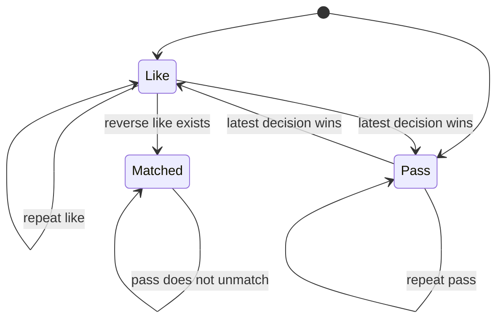
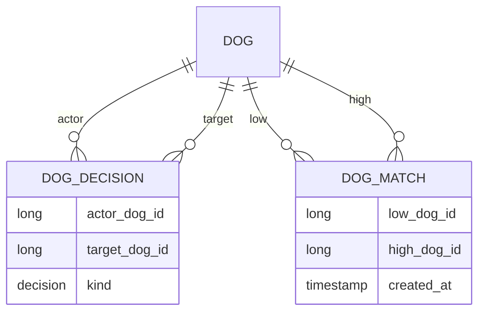
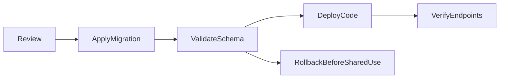

# Technical Design: Mutual Match Detection

## Overview

This feature adds durable dog-to-dog decisions and mutual matches to the existing Spring Boot backend. It lets a client submit a like or pass, creates one undirected match when two likes are reciprocal, and reads matches for either dog.

The feature is implemented as a vertical slice in `match/`. It does not add authentication, owner accounts, push notifications, chat, candidate filtering, or scoring changes.

### Goals

- Persist one latest decision per actor-target pair.
- Create exactly one durable match per unordered pair after reciprocal likes.
- Return immediate match feedback for a like and provide a newest-first match list.
- Preserve atomicity and idempotency under retries and concurrent reciprocal likes.

### Non-Goals

- Push or in-app notifications, device registration, or unread state.
- Authentication and authorization; dog IDs remain the current identity boundary.
- Unmatching, blocking, reporting, chat, filtering, radius, or score changes.

## Boundary Commitments

### This Spec Owns

- The `Decision` and `Match` domain records and their persistence.
- Decision validation, replacement, reciprocity detection, match creation, and match listing.
- HTTP contracts for submitting decisions and reading a dog's matches.
- Liquibase changesets for decision and match tables.

### Out of Boundary

- `Dog` profile ownership and authentication.
- Candidate ranking and compatibility scoring.
- Notification delivery of any kind.
- Match dissolution or moderation.

### Allowed Dependencies

- `DogRepository` and the existing `Dog` identity from the `dog` package.
- Spring Data JPA, Spring transactions, PostgreSQL, and Liquibase already present in the project.
- The client may poll the match list or use the decision response; no outbound notification dependency is introduced.

The dependency direction is `dog -> none`; `match` may read `dog`; controllers call match services; services call the persistence **ports** owned by `match`; adapters own persistence only. `DogMatchController` serves a path under `/api/dogs` but belongs to `match` — a URL is not a package dependency.

### Revalidation Triggers

- Introducing owner accounts or authentication changes the actor identity and authorization contract.
- Adding notifications changes the decision response and match lifecycle integration.
- Changing match dissolution changes the invariant that matches survive a like-to-pass revision.
- Changing table names, pair ordering, or API payloads requires downstream client and migration review.

## Architecture

### Existing Architecture Analysis

The application is a single synchronous Spring MVC service using constructor injection, JPA, PostgreSQL, and Liquibase. `MatchScoreService` is stateless and currently computes ranked compatibility; it must not be used as a gate for decisions because unscorable dogs may still like and match. `ddl-auto: validate` requires the entity mappings and migrations to agree at startup. `open-in-view: false` means match queries must load all response data inside the service transaction.

### Architecture Pattern & Boundary Map

The design uses a single transactional matching service with focused repositories. The database enforces the two uniqueness invariants: one decision per directed pair and one match per unordered pair.





**Concurrency decision:** the unique constraint on the canonical pair is the serialization point. The insert is written so a losing race is *not an error*: `INSERT ... ON CONFLICT DO NOTHING` leaves the transaction healthy whether it inserted or not, and the match is then read back unconditionally. Both racers therefore return the same row.

This is deliberate, and the alternative was rejected for a concrete reason: on PostgreSQL a unique-constraint *violation* aborts the whole transaction and poisons the persistence context, so catching the translated `DataIntegrityViolationException` and reading the winner **on the same transaction** cannot work — the follow-up read fails and the transaction is already rollback-only. Conflict must be avoided, not caught. Application-level locks are not used because they would not coordinate across service instances.

Because the insert never raises, decision write and match creation stay inside one transaction and Requirement 6.2 holds without a nested or retried transaction.

### Technology Stack

| Layer | Choice / Version | Role in Feature | Notes |
|---|---|---|---|
| Backend | Kotlin 2.3, Spring Boot 4.1 | Controllers, DTOs, service | Existing stack; no new dependency |
| Persistence | Spring Data JPA, Hibernate 7 | Entities and repositories | Existing stack; `open-in-view: false` |
| Data | PostgreSQL 18 | Durable decisions and matches | Unique constraints enforce pair invariants |
| Schema | Liquibase formatted SQL | Tables, constraints, indexes | New file `005-create-matching.sql`, appended to master |
| Runtime | JDK 25, Maven 3.9 | Build and test | Use `mise run test` and `mise run build` |

## File Structure Plan

### Directory Structure

```text
src/main/kotlin/com/ai4dev/tinder4dogs/match/
├── Decision.kt              # Decision entity, DecisionKind enum, Decisions port
├── DecisionRepository.kt    # JPA adapter implementing Decisions
├── Match.kt                 # Match entity and Matches port
├── MatchRepository.kt       # JPA adapter implementing Matches, incl. conflict-free insert
├── MatchingService.kt       # Decision lifecycle, reciprocity rules, sealed outcomes
├── MatchingClockConfiguration.kt # UTC Clock bean
├── DecisionController.kt    # HTTP decision submission and its DTOs
├── DogMatchController.kt    # Match-list endpoint under /api/dogs/{dogId}/matches
└── MatchController.kt       # Existing score endpoints, response type renamed

src/main/resources/db/changelog/
├── db.changelog-master.yaml # Register new migration
└── changes/005-create-matching.sql # Decision and dog_match schema

src/test/kotlin/com/ai4dev/tinder4dogs/match/
├── InMemoryMatching.kt          # Hand-written fakes for Decisions, Matches, dog lookup
├── MatchingServiceTest.kt       # Decision, reciprocity, idempotency, and errors
├── DecisionControllerTest.kt    # Outcome-to-status translation
├── DogMatchControllerTest.kt    # Match-list mapping
└── MatchControllerTest.kt       # Score endpoint payload characterization
```

### Modified Files

- `src/main/kotlin/com/ai4dev/tinder4dogs/match/MatchController.kt` — retain both score endpoints unchanged in path, status and JSON field names; rename only the Kotlin type `MatchResponse` to `MatchScoreResponse` so the new match payload does not overload it. Scoring ownership does not move, and the match list does **not** live here.
- `src/main/resources/db/changelog/db.changelog-master.yaml` — append the `005-create-matching.sql` include; do not alter existing includes.
- `pom.xml` — no change expected; all required dependencies already exist.

### Why the match list is not on `MatchController`

`MatchController` already maps `GET /api/matches/{id}` (ranked candidates) and `GET /api/matches/{aId}/{bId}` (pairwise score). A match list at `GET /api/matches/{dogId}` would be an **ambiguous mapping** against the first and fail at application startup, and any two-segment variant collides with the second. The match list is therefore a subresource of the dog: `GET /api/dogs/{dogId}/matches`.

`DogMatchController` lives in the `match` package even though its path sits under `/api/dogs`, because the data and the rules are owned by `match`. This does not invert the package dependency: `match` still reads `dog`, and `dog` still knows nothing of `match`. The URL is a naming choice, not a coupling.

## System Flows

### Decision State Flow



A decision is upserted before reciprocity is evaluated. A pass never creates a match. A changed decision may alter the decision row, but never removes an existing match.

## Requirements Traceability

| Requirement | Summary | Components | Interfaces | Flows |
|---|---|---|---|---|
| 1.1 | Record like | MatchingService, DecisionRepository, DecisionController | Decision API | Decision submission |
| 1.2 | Record pass without match | MatchingService, DecisionRepository | Decision API | Decision state flow |
| 1.3 | Durable decisions | Decision entity, migration | Persistence | Restart durability |
| 1.4 | Unknown dog rejected | MatchingService, DogRepository | Error result | Validation |
| 1.5 | Self-decision rejected | MatchingService | Error result | Validation |
| 1.6 | Unscorable dogs allowed | MatchingService | Decision service | Decision submission |
| 2.1 | Same decision idempotent | MatchingService, DecisionRepository | Decision API | State flow |
| 2.2 | Opposite decision replaces | MatchingService, DecisionRepository | Decision API | State flow |
| 2.3 | Pass-to-like may match | MatchingService, MatchRepository | Decision result | Reciprocity |
| 2.4 | Existing match retained | MatchingService, MatchRepository | Match API | State flow |
| 2.5 | One directed decision | DecisionRepository, database constraint | Persistence | Upsert |
| 3.1 | Reciprocal likes create match | MatchingService, MatchRepository | Decision result | Reciprocity |
| 3.2 | One-sided like no match | MatchingService | Decision result | Reciprocity |
| 3.3 | Pass never matches | MatchingService | Decision result | Decision state flow |
| 3.4 | One match per pair | MatchRepository, database constraint | Persistence | Canonical pair |
| 3.5 | Concurrent likes one match | MatchingService, MatchRepository | Persistence | Concurrent sequence |
| 3.6 | Undirected match | Match entity, canonical pair | Match API | Match listing |
| 3.7 | Creation timestamp | Match entity, migration | Match API | Match listing |
| 4.1 | New match feedback | MatchingService, DecisionController | Decision response | Decision submission |
| 4.2 | No-match feedback | MatchingService, DecisionController | Decision response | Decision submission |
| 4.3 | Existing match feedback | MatchingService, MatchRepository | Decision response | Retry |
| 5.1 | List all matches | MatchingService, MatchRepository, DogMatchController | Match list API | Match query |
| 5.2 | Other dog and timestamp | DogMatchController, Match response | Match list API | Match query |
| 5.3 | Newest first | MatchRepository, MatchingService | Match list API | Match query |
| 5.4 | Empty list | MatchingService | Match list API | Match query |
| 5.5 | Unknown dog error | MatchingService, KnownDogs | Error result | Validation |
| 5.6 | Unscorable match readable | MatchingService, DogMatchController | Match list API | Match query |
| 6.1 | Durable matches | Match entity, migration | Persistence | Restart durability |
| 6.2 | No partial outcome | MatchingService transaction | Decision API | Failure handling |
| 6.3 | No score prerequisite | MatchingService | Decision service | Decision submission |

## Components and Interfaces

| Component | Domain/Layer | Intent | Req Coverage | Key Dependencies | Contracts |
|---|---|---|---|---|---|
| `Decision` | Match/domain | Represent one latest directional decision | 1.1–1.6, 2.1–2.5 | None | State |
| `Match` | Match/domain | Represent one canonical unordered pair | 3.1–3.7, 4.1–4.3, 5.1–5.6 | None | State |
| `Decisions` / `DecisionRepository` | Match/persistence | Directed decision port and its JPA adapter | 1, 2, 3 | JPA (P0) | Service |
| `Matches` / `MatchRepository` | Match/persistence | Canonical match port and its JPA adapter | 3, 4, 5, 6 | JPA (P0) | Service |
| `KnownDogs` | Match/persistence | One-method dog existence port over DogRepository | 1.4, 5.5 | DogRepository (P0) | Service |
| `MatchingClockConfiguration` | Match/config | Declare the UTC `Clock` bean Spring does not provide | 3.7 | None | State |
| `MatchingService` | Match/domain service | Own all decision and match rules | 1–6 | KnownDogs, both ports, Clock (P0) | Service |
| `DecisionController` | Match/HTTP | Translate decision HTTP requests/results | 1, 2, 3, 4, 6 | MatchingService (P0) | API |
| `DogMatchController` | Match/HTTP | Expose a dog's match list | 5 | MatchingService (P0) | API |
| `MatchController` | Match/HTTP | Preserve existing score API unchanged | None | Existing score dependencies | API |

### Match Domain

#### Decision

| Field | Detail |
|---|---|
| Intent | Store the latest decision from one dog toward another |
| Requirements | 1.1–1.6, 2.1–2.5 |

**Responsibilities & Constraints**

- `actorId` and `targetId` are distinct existing dog IDs.
- `kind` is a closed enum with `LIKE` and `PASS`.
- The directed pair `(actorId, targetId)` is unique.
- Updating the opposite kind replaces the current row; repeated same-kind submission is a no-op.

**Persistence shape**

- Entity table: `dog_decision`.
- Columns: identity `id`, `actor_dog_id`, `target_dog_id`, `decision`.
- Named unique constraint: `uk_dog_decision_actor_target`.
- Both dog references use foreign keys with `ON DELETE CASCADE`.

### Match Domain

#### Match

| Field | Detail |
|---|---|
| Intent | Store one durable, undirected match |
| Requirements | 3.1–3.7, 4.1–4.3, 5.1–5.6 |

**Responsibilities & Constraints**

- `lowDogId = min(firstDogId, secondDogId)` and `highDogId = max(firstDogId, secondDogId)`.
- `lowDogId < highDogId`; self-pairs cannot be represented.
- The canonical pair is unique.
- `createdAt` is UTC and immutable after creation.
- Both dog references use foreign keys with `ON DELETE CASCADE`.

**Persistence shape**

- Entity table: `dog_match`.
- Columns: identity `id`, `low_dog_id`, `high_dog_id`, `created_at`.
- Named unique constraint: `uk_dog_match_pair`.
- Indexes support lookup by `low_dog_id`, `high_dog_id`, and newest-first creation time. The migration may use named indexes `ix_dog_match_low_dog`, `ix_dog_match_high_dog`, and `ix_dog_match_created_at`.

### Persistence Components

#### DecisionRepository

| Field | Detail |
|---|---|
| Intent | Provide directed decision reads and writes to the service |
| Requirements | 1.1–1.3, 2.1–2.5, 3.1–3.3 |

**Contracts**: Service [x] / API [ ] / Event [ ] / Batch [ ] / State [x]

`MatchingService` depends on a narrow port, not on `JpaRepository`:

```kotlin
interface Decisions {
    fun find(actorId: Long, targetId: Long): Decision?
    fun findLike(actorId: Long, targetId: Long): Decision?
    fun save(decision: Decision): Decision
}
```

`DecisionRepository : JpaRepository<Decision, Long>, Decisions` — Spring Data derives all three from their names, so the adapter carries no hand-written body. The port exists so the service can be instantiated directly in a unit test against a hand-written in-memory fake with three methods, instead of a `JpaRepository` with forty.

The repository must not create matches or apply domain decisions.

#### MatchRepository

| Field | Detail |
|---|---|
| Intent | Provide canonical-pair match persistence and dog lookup |
| Requirements | 3.1–3.7, 4.1–4.3, 5.1–5.6, 6.1–6.2 |

**Contracts**: Service [x] / API [ ] / Event [ ] / Batch [ ] / State [x]

```kotlin
interface Matches {
    fun findPair(lowDogId: Long, highDogId: Long): Match?
    fun insertIgnoringConflict(lowDogId: Long, highDogId: Long, createdAt: Instant)
    fun findAllFor(dogId: Long): List<Match>
}
```

`MatchRepository : JpaRepository<Match, Long>, Matches` implements the port. Two of the three are derived; `insertIgnoringConflict` is a native modifying query:

```sql
INSERT INTO dog_match (low_dog_id, high_dog_id, created_at)
VALUES (:lowDogId, :highDogId, :createdAt)
ON CONFLICT ON CONSTRAINT uk_dog_match_pair DO NOTHING
```

It returns no entity and raises nothing on conflict; the caller always reads the pair back afterwards. `findAllFor` matches the dog on either side ordered `created_at DESC`, and needs `@Query` because the disjunction spans two columns.

The service maps each row to the other dog; the repository does not own HTTP response shape.

### Service Layer

#### MatchingService

| Field | Detail |
|---|---|
| Intent | Execute the decision lifecycle and reciprocal match rule in one transaction |
| Requirements | 1.1–6.3 |

**Dependencies**

- Inbound: `DecisionController`, `DogMatchController` — requests (P0).
- Outbound: `DogRepository` — existence checks and dog lookup (P0).
- Outbound: `Decisions`, `Matches` ports — persistence (P0).
- External: `Clock` — deterministic UTC timestamps (P1). Spring Boot auto-configures **no** `java.time.Clock` and this codebase has no `@Configuration` class, so `MatchingClockConfiguration` must declare `Clock.systemUTC()` as a bean before the service can be wired. A test passes `Clock.fixed(...)` directly.

**Contracts**: Service [x] / API [ ] / Event [ ] / Batch [ ] / State [x]

```kotlin
fun decide(actorId: Long, targetId: Long, kind: DecisionKind): DecisionOutcome
fun matchesFor(dogId: Long): MatchListOutcome
```

`DecisionOutcome` is a sealed result with explicit variants for accepted decision plus optional match, unknown dog, and self-decision. `MatchListOutcome` is a sealed result for a match list or unknown dog. The concrete Kotlin names are implementation contracts and must remain exhaustively handled by controllers.

**Preconditions**

- IDs are positive request values.
- Actor and target are distinct.
- Both dogs exist.

**Postconditions**

- Exactly one latest decision exists for the directed pair.
- A reciprocal like yields an existing or newly created canonical match.
- A pass never creates a match.
- Existing matches are never deleted or changed by decision revision.

**Transaction and concurrency**

- `decide` is one write transaction covering decision upsert and match creation/readback.
- `matchesFor` is read-only transactional so both dog references and response fields are loaded before the session closes.
- Match creation is always `insertIgnoringConflict` followed by an unconditional `findPair`. The service never distinguishes "I inserted it" from "the other racer did" — both return the same row, which is exactly Requirement 3.5. No exception is caught, no write is retried, and the transaction is never poisoned.
- Do not use `MatchScoreService` or inspect dog age.

### HTTP Components

#### DecisionController

| Method | Endpoint | Request | Response | Errors |
|---|---|---|---|---|
| POST | `/api/decisions` | `{ actorDogId, targetDogId, decision }` | `{ actorDogId, targetDogId, decision, matched, match }` | 400 invalid shape, 404 unknown dog, 422 self-decision, 500 persistence failure |

`decision` serializes as `LIKE` or `PASS`. `match` is nullable and contains the match ID, other dog ID, and UTC `createdAt` when `matched` is true. Repeated submissions return the same semantic result.

#### DogMatchController

| Method | Endpoint | Request | Response | Errors |
|---|---|---|---|---|
| GET | `/api/dogs/{dogId}/matches` | path dog ID | array of `{ matchId, otherDogId, createdAt }` | 404 unknown dog, 500 persistence failure |

Newest first; an empty array, not a 404, for a dog with no matches. The `MatchSummaryResponse` payload type is declared here and reused by `DecisionController` for its nullable `match` field.

#### MatchController

Unchanged in behaviour: `GET /api/matches/{id}` and `GET /api/matches/{aId}/{bId}` keep their paths, statuses and JSON field names (`dogId`, `name`, `score`). The Kotlin type `MatchResponse` is renamed `MatchScoreResponse`; this is a source-level rename with no wire effect. A characterization test pins the payload *before* the rename is made.

## Data Models

### Domain Model



The decision is directed; the match is canonical and undirected. The dog entity remains owned by `dog/` and is not modified for this feature.

### Logical Data Model

- `dog_decision(actor_dog_id, target_dog_id, decision)` has one row per directed pair.
- `dog_match(low_dog_id, high_dog_id, created_at)` has one row per unordered pair.
- Both tables reference `dog(id)` and cascade when a dog is deleted, matching existing preference behavior.
- Match creation and decision revision share one transaction; no match is deleted by this feature.

### Physical Data Model

Migration file `005-create-matching.sql` contains two changesets:

1. `005-create-dog-decision`: identity `BIGINT`, two `BIGINT NOT NULL` dog references, `VARCHAR(10) NOT NULL` decision, named primary/foreign/unique constraints.
2. `006-create-dog-match`: identity `BIGINT`, two `BIGINT NOT NULL` canonical dog references, `TIMESTAMP WITH TIME ZONE NOT NULL` creation time, named primary/foreign/unique constraints and lookup indexes.

The master YAML appends the file include. Existing changesets remain untouched. Hibernate mappings use `@Table(name = "dog_decision")` and `@Table(name = "dog_match")`; the SQL table is intentionally not named `match`.

Changeset ids are `tinder4dogs:005-create-dog-decision` and `tinder4dogs:006-create-dog-match`, both inside file `005-create-matching.sql` — the file number is not the changeset id, and ids `001`–`004` are already taken. Each carries a `--comment:` and an explicit `--rollback`, matching `001-create-dog.sql`.

**Dog references map as plain `Long` columns, not `@ManyToOne` associations.** Nothing in this feature navigates from a decision or a match to a `Dog`; the responses carry dog *ids* only. Plain columns keep `ddl-auto: validate` agreeing with the SQL above, avoid lazy proxies under `open-in-view: false`, and keep the fakes trivial. The foreign keys still exist in the database — they are simply not mapped as associations.

## Error Handling

### Error Strategy

Controllers translate sealed service outcomes to HTTP responses. Domain validation is performed before persistence. Persistence failures are not converted into successful outcomes. No global exception handler is added in this feature.

### Error Categories and Responses

- Unknown actor, target, or query dog: `404 Not Found` with no write.
- Self-decision: `422 Unprocessable Entity` with no write.
- Malformed request or invalid enum/ID shape: existing Spring validation behavior, `400 Bad Request`.
- Unique match race: internal normal path; return the existing match.
- Unexpected persistence failure: `500` and transaction rollback; no partial decision or match is reported.

## Testing Strategy

### How the service is tested without a database

`MatchingService` takes the `Decisions` and `Matches` ports, `DogRepository`, and a `Clock`. Tests instantiate it directly — no Spring context, no database, consistent with `MatchScoreServiceTest` and with `mise run test` needing no database.

`InMemoryMatching.kt` provides hand-written fakes. They are small because the ports are small, and they must reproduce both uniqueness invariants: one decision per directed pair, one match per canonical pair with `insertIgnoringConflict` silently doing nothing when the pair is present. That last behaviour is what makes the concurrent-like path reachable in a unit test: a test seeds the winning match first, then drives a like through the service and asserts it returns the seeded row.

The fakes get no tests of their own. They are exercised through the service tests below; a test that only pins a fake pins nothing about the product.

`DogRepository` is owned by the `dog` package and must not be changed by this feature, but faking a `JpaRepository` in Kotlin means implementing every inherited method. So `match` declares its own one-method port and its own adapter:

```kotlin
interface KnownDogs { fun exists(dogId: Long): Boolean }

@Component
class KnownDogsFromRepository(private val dogs: DogRepository) : KnownDogs {
    override fun exists(dogId: Long) = dogs.existsById(dogId)
}
```

The port and adapter both live in `match/`, so the dependency still runs `match -> dog` and `dog` remains untouched. `MatchingService` depends on `KnownDogs`; the fake is one line.

### Unit Tests

- `MatchingServiceTest`: an unknown actor/target returns the unknown-dog outcome and performs no save (1.4, 5.5).
- `MatchingServiceTest`: a self-decision returns the invalid outcome and performs no save (1.5).
- `MatchingServiceTest`: like and pass are persisted independently of negative dog age; pass has no match (1.1, 1.2, 1.6, 3.3, 6.3).
- `MatchingServiceTest`: repeated same decision is idempotent; opposite decision replaces the stored decision; like-after-pass creates reciprocity while like-to-pass does not delete an existing match (2.1–2.5).
- `MatchingServiceTest`: reciprocal likes create one canonical match, repeated/reversed calls return the same match, and a simulated unique conflict reads the winner (3.1–3.6, 4.1–4.3).
- `MatchingServiceTest`: injected fixed `Clock` makes `createdAt` deterministic and match lists are mapped newest-first, including unscorable dogs and empty lists (3.7, 5.1–5.6).

### Integration Tests

No database-backed test is added to the current unit-only suite because the repository has no Testcontainers or in-memory database dependency, and adding one would change the `mise run test` contract — a decision for its own specification, not a side effect of this feature.

Three things consequently **cannot** be pinned by the automated suite, and are honestly out of reach until that decision is taken: that the database actually refuses a duplicate directed decision and a duplicate canonical pair (3.4), that two genuinely concurrent transactions produce one match (3.5), and that records survive a restart (6.1). The unit tests pin the *service's* behaviour against fakes that reproduce those invariants; they do not prove the schema enforces them.

What closes that gap without manual ceremony is `ddl-auto: validate`: the application refuses to start unless the mappings and the migrated schema agree, so a mismatched constraint surfaces on the first `mise run run`. Task-level verification therefore asserts startup, and the remaining concurrency and durability claims are recorded here as known limitations rather than as checklist items (3.4, 3.5, 6.1, 6.2).

### HTTP Tests

Controllers are instantiated directly with a stubbed `MatchingService`, no Spring context — the same style as the service tests.

- `DecisionController` tests verify status translation for accepted like/pass, unknown dog, self-decision, and the match payload on both a new and a re-submitted like (1.1–4.3).
- `DogMatchController` tests verify newest-first mapping, empty array, and unknown dog (5.1–5.6).
- `MatchControllerTest` characterizes the two existing score endpoints — paths, statuses and the `dogId`/`name`/`score` field names — and is written **before** `MatchResponse` is renamed, so the rename has a regression net that currently does not exist.

## Security Considerations

Authentication and authorization are explicitly out of scope because no user identity exists. The dog ID is therefore the current caller-supplied identity boundary. Introducing owner accounts must revalidate every decision endpoint before production use; otherwise a caller could submit decisions for arbitrary dogs.

## Performance & Scalability

The feature adds indexed pair lookups and dog match lookups. The canonical-pair unique constraint is both an integrity guarantee and an efficient existence check. No caching is introduced because correctness under decision revisions and match creation is more important than avoiding a small relational lookup.

## Migration Strategy



- Review the immutable SQL before first application.
- Apply changeset `005` and `006` through the master changelog.
- Start the application and let `ddl-auto: validate` check mappings.
- Deploy code and verify decision, reciprocal-like, duplicate, and listing flows.
- If a migration error is found after the changeset has run anywhere, add a new corrective changeset; do not edit `005`.
